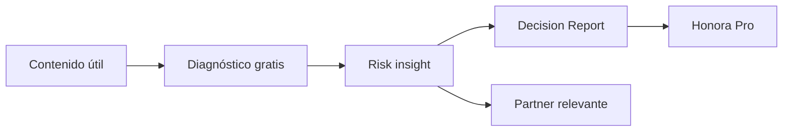

# Plan de negocio — Honora

## 1. Tesis

Los profesionales independientes suelen fijar precios mirando al mercado, al cliente o a su facturación pasada. Honora cambia la unidad de decisión: primero calcula la estructura que debe protegerse y luego traduce ese resultado a tarifa, runway y acciones.

El MVP evita costos fijos altos: no requiere base de datos, autenticación ni APIs pagadas. Su función inicial es demostrar valor, captar intención de pago y aprender qué segmento convierte mejor.

## 2. Ideal Customer Profile

Primer mercado: profesionales independientes en Perú que venden conocimiento o tiempo y facturan de forma variable.

- consultores;
- diseñadores y marketers;
- desarrolladores y especialistas digitales;
- fotógrafos y productores;
- coaches, terapeutas y otros profesionales de servicios;
- personas que trabajan con dos a ocho clientes activos.

Se prioriza a quien ya factura pero todavía administra su negocio con memoria, notas o una hoja sin indicadores.

## 3. Jobs to be done

1. “Necesito saber cuánto cobrar sin trabajar a pérdida.”
2. “Quiero saber si puedo sobrevivir a un mes malo.”
3. “Necesito entender cuánto dependo de mi cliente principal.”
4. “Quiero un reporte claro para decidir qué corregir primero.”

## 4. Revenue model

| Línea | Precio inicial | Hipótesis |
|---|---:|---|
| Diagnóstico gratuito | S/ 0 | Convierte tráfico en activaciones |
| Decision Report | S/ 9.90 | Compra impulsiva después de observar un riesgo |
| Honora Pro | S/ 19.90/mes | Seguimiento e historial justifican recurrencia |
| Referrals | Por acuerdo | Comisión de aliados sin cobrarle más al usuario |

No se proyecta ingreso por referral hasta firmar un acuerdo real. Los espacios del MVP sirven para demostrar dónde aparecería el partner y medir interés.

## 5. Unit economics iniciales

Supuesto de gasto fijo mensual: entre S/ 0 y S/ 50.

| Escenario | Pro subscribers | Subscription MRR | 30 reportes/mes | Revenue mensual antes de fees |
|---|---:|---:|---:|---:|
| Validación | 10 | S/ 199 | S/ 297 | S/ 496 |
| Tracción | 25 | S/ 497.50 | S/ 297 | S/ 794.50 |
| Base sostenible | 50 | S/ 995 | S/ 297 | S/ 1,292 |
| Escala inicial | 100 | S/ 1,990 | S/ 297 | S/ 2,287 |

Con un costo fijo de S/ 50, tres suscriptores Pro generan S/ 59.70 brutos y cubren ese gasto antes de payment fees. Esta cifra no incluye impuestos, devoluciones, soporte ni costo de adquisición.

## 6. Funnel

La conversión debe aparecer después del insight, no antes. El usuario primero descubre un pricing gap, concentración o falta de runway; luego recibe una oferta que amplía el análisis.

## 7. Go-to-market de 30 días

### Semana 1 — Activación

- Publicar el diagnóstico como herramienta gratuita.
- Crear tres demostraciones: diseñador, consultor y profesional de salud.
- Medir cuántas personas completan los ocho inputs y el bloque de revenue risk.

### Semana 2 — Intención de pago

- Promover el Decision Report por S/ 9.90.
- Registrar clics e issues de early access como señal, sin confundirlos con ventas.
- Entrevistar a quienes expresen interés para identificar el insight más valioso.

### Semana 3 — Primera venta

- Entregar manualmente los primeros reportes.
- Comparar willingness to pay entre precio, cobranza y riesgo de clientes.
- Definir qué resultado debe permanecer gratuito y qué resultado justifica Pro.

### Semana 4 — Recurrencia

- Ofrecer Honora Pro a usuarios que actualizan sus números más de una vez.
- Buscar un aliado contable o de cobros para un piloto de referral.
- Decidir si se justifica agregar cuentas y almacenamiento online.

## 8. Métricas de validación

| Métrica | Gate inicial |
|---|---:|
| Diagnósticos completados | 50 |
| Personas que llegan a pricing | 15 |
| Solicitudes de Decision Report | 5 |
| Pagos reales | 3 |
| Solicitudes de Pro | 3 |
| Segundo uso en 30 días | 20% |

No construir backend de pago, cuentas ni automatizaciones complejas antes de observar al menos tres pagos reales o una señal equivalente de demanda.

## 9. Roadmap condicionado a demanda

1. **MVP local-first:** diagnóstico, stress test y captación de intención.
2. **Paid report:** exportación PDF y entrega manual.
3. **Pro:** cuentas, historial mensual, clientes y alerts.
4. **Payments:** checkout local compatible con Perú.
5. **Partner marketplace:** referidos trazables y disclosure de comisión.

## 10. Riesgos y controles

- No presentar la reserva configurable como tasa tributaria.
- No solicitar datos bancarios en el MVP.
- No almacenar cifras financieras en formularios públicos.
- Mostrar claramente que no existe asesoría contable, tributaria ni legal.
- Identificar cualquier vínculo comercial cuando se activen referrals.

## 11. Fuentes operativas oficiales

- [SUNAT — Trabajador independiente](https://personas.sunat.gob.pe/trabajador-independiente)
- [Mercado Pago Developers Perú](https://www.mercadopago.com.pe/developers/es)

Estas fuentes sirven para entender el contexto operativo peruano. Honora no replica ni sustituye los servicios de SUNAT o de un proveedor de pagos.
